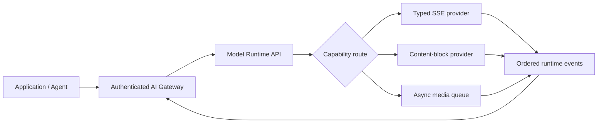
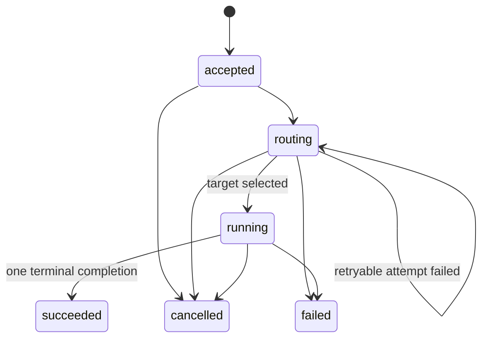

<p align="center">
  
</p>

<h1 align="center">Model Runtime API</h1>

<p align="center">
  A provider-neutral execution data plane for routing, controlling, observing, and metering AI model calls.
</p>

<p align="center">
  <a href="README.zh-CN.md">简体中文</a> ·
  <a href="docs/README.md">Documentation</a> ·
  <a href="spec/openapi.yaml">OpenAPI</a> ·
  <a href="https://github.com/capa-cloud/model-runtime-api/releases/tag/v0.1.0">v0.1.0</a>
</p>

<p align="center">
  
  
  
  
  
</p>

> **Status:** `v0.1.0` pre-alpha. The protocol and reference runtime are usable for evaluation;
> provider adapters are contract-tested with sanitized local fixtures, not certified against live
> provider accounts. The reference server is unauthenticated and must remain on loopback or behind a
> trusted gateway.

## Why this exists

AI providers expose similar capabilities through different request shapes, stream events, tool-call
formats, usage fields, and asynchronous task lifecycles. An application should not need to own every
provider difference, but a portability layer should not pretend those differences disappear.

Model Runtime API standardizes the **execution lifecycle** while keeping provider behavior behind an
explicit SPI:



The gateway owns tenant trust. The runtime owns provider execution.

## Choose your path

| I want to... | Start here |
| --- | --- |
| Understand boundaries and packages | [Architecture](docs/architecture.md) |
| Integrate an application | [Quick start](#quick-start) and the [TypeScript](packages/sdk-typescript/src/index.ts), [Go](sdk/go/README.md), or [Python](sdk/python/README.md) client |
| Configure a public provider adapter | [Provider adapters](docs/guides/provider-adapters.md) |
| Put an authenticated gateway in front | [Gateway integration](docs/guides/gateway-integration.md) |
| Implement another adapter | [Adding a provider](docs/guides/adding-a-provider.md) |
| Review protocol semantics | [Runtime model](spec/runtime-model.md), [Protocol](spec/protocol.md), and [OpenAPI](spec/openapi.yaml) |
| Verify security and release evidence | [Threat model](docs/security/threat-model.md) and [v0.1.0 verification](docs/releases/0.1.0-verification.md) |

## Runtime responsibilities

| The runtime owns | The runtime deliberately does not own |
| --- | --- |
| Ability and capability-based provider selection | Caller authentication and tenant authorization |
| Provider-local concurrency, queue admission, retry budget, and fallback | Tenant RPM/TPM, commercial quotas, or budgets |
| Idempotent submit, status, result, cancellation, and resumable SSE | Wallets, prices, discounts, invoices, or payment |
| Provider error normalization and route-attempt evidence | Model-quality equivalence across providers |
| Immutable usage facts and metadata-only telemetry mapping | Prompt/output logging by default |

## Quick start

Requirements: Node.js 22 or later and pnpm 10.

```bash
pnpm install
pnpm check
pnpm dev
```

The default server binds to `127.0.0.1:4320` and loads only the deterministic Mock Provider.

```bash
curl -s http://127.0.0.1:4320/v1/runtime

curl -s -X POST http://127.0.0.1:4320/v1/executions \
  -H 'content-type: application/json' \
  -H 'idempotency-key: request-public' \
  -d '{
    "ability":"text-generation",
    "requirements":{"stream":true},
    "input":[{"type":"text","text":"hello"}]
  }'
```

The create call returns `202 Accepted` and an execution ID:

```bash
curl -N http://127.0.0.1:4320/v1/executions/EXECUTION_ID/events
curl -s http://127.0.0.1:4320/v1/executions/EXECUTION_ID
curl -s http://127.0.0.1:4320/v1/executions/EXECUTION_ID/result
curl -s -X POST http://127.0.0.1:4320/v1/executions/EXECUTION_ID/cancel
```

## One execution lifecycle

<p align="center">
  
</p>

<p align="center"><em>Concept image only. The state machine below is normative.</em></p>



Every event has an execution-scoped monotonic sequence. Consumers reconnect with `after` or
`Last-Event-ID`; the EventStore materializes text, tool arguments, media results, artifacts, and usage
from the append-only event stream.

## Provider adapters

<p align="center">
  
</p>

| Adapter | Public protocol shape | Normalized behavior |
| --- | --- | --- |
| OpenAI Responses | Typed response SSE | Text, function calls, usage, terminal completion |
| Anthropic Messages | Content-block SSE | Text blocks, partial tool JSON, usage, message stop |
| fal Queue | Submit, status, result, cancel | Queue progress, result object, artifact references |
| Mock | Deterministic in-process stream | Development, conformance, and CI fixtures |

Adapters are disabled unless selected by deployment configuration. Configuration references
credential **environment variable names**, never credential values. Implementation evidence is
recorded in the [public source registry](docs/evidence/provider-sources.md).

## Usage is not billing

<p align="center">
  
</p>

The runtime records provider-reported or runtime-derived facts such as input/output/cache/reasoning
tokens, media counts or seconds, and tool requests:

```text
usage fact -> price resolution -> customer ledger -> invoice
     ^
     Model Runtime API stops here
```

Price catalogs, currency conversion, discounts, adjustments, and customer billing remain separate.
See [ADR-0002](docs/decisions/0002-usage-is-not-billing.md).

## Workspace packages

| Package | Responsibility |
| --- | --- |
| `@model-runtime/protocol` | Types, events, state, generated request schema, and usage vocabulary |
| `@model-runtime/core` | Provider registry, routing, flow control, EventStore, and execution runtime |
| `@model-runtime/server` | Loopback HTTP/SSE server and safe provider configuration |
| `@model-runtime/conformance` | Reusable provider lifecycle assertions |
| `@model-runtime/provider-*` | Mock, OpenAI Responses, Anthropic Messages, and fal Queue adapters |
| `@model-runtime/sdk-typescript` | TypeScript HTTP/SSE client |
| `@model-runtime/otel` | Metadata-only OpenTelemetry GenAI attribute mapping |
| `@model-runtime/catalog` | Versioned capability snapshots and model diff |
| `sdk/go`, `sdk/python` | Go and Python runtime clients |

Workspace package names remain private until the public API receives enough implementation feedback.

## Deployment and security

```bash
docker build -t model-runtime-api:local .
docker run --rm -p 127.0.0.1:4320:4320 \
  -e MODEL_RUNTIME_HOST=0.0.0.0 model-runtime-api:local
```

The image runs as non-root and supports a read-only root filesystem. It includes Mock only unless a
deployment supplies `MODEL_RUNTIME_CONFIG`. The Kubernetes example under `deploy/` uses fictional
image names and keeps the runtime as a sidecar.

All examples are public and fictional. Do not submit credentials, private endpoints, customer data,
production logs, private prices, or proprietary routing policy. Run `pnpm scan:public` before every
commit. See [Security](SECURITY.md), [Contributing](CONTRIBUTING.md), and the
[testing guide](docs/testing.md).

## License

Apache License 2.0.
