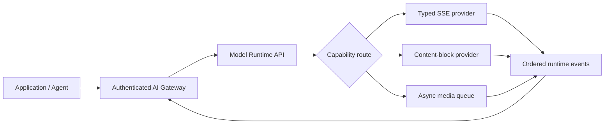
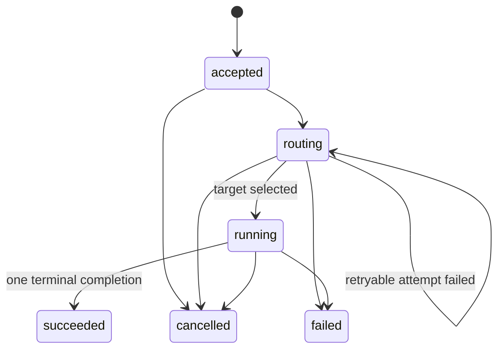

<p align="center">
  
</p>

<h1 align="center">Model Runtime API</h1>

<p align="center">供应商中立的 AI 模型执行数据面：路由、控制、观测和计量一次模型执行。</p>

<p align="center">
  <a href="README.md">English</a> ·
  <a href="docs/README.md">文档索引</a> ·
  <a href="spec/openapi.yaml">OpenAPI</a> ·
  <a href="https://github.com/capa-cloud/model-runtime-api/releases/tag/v0.1.0">v0.1.0</a>
</p>

> **状态：** `v0.1.0` pre-alpha。协议和参考 Runtime 可用于评估；Provider Adapter
> 通过了本地脱敏 fixture 契约测试，但没有使用真实供应商账号认证。参考服务不包含鉴权，必须保持在 loopback 或可信 Gateway 之后。

## 为什么需要 Model Runtime

不同 AI Provider 的请求字段、SSE 事件、工具调用、Usage 和异步任务生命周期并不一致。应用不应该重复处理全部差异，但兼容层也不能假装这些差异不存在。

Model Runtime API 统一的是**执行生命周期**，Provider 差异保留在明确的 SPI 后面：



Gateway 负责租户信任，Runtime 负责 Provider 执行。

## 阅读入口

| 目标 | 入口 |
| --- | --- |
| 理解系统边界和模块 | [架构](docs/architecture.md) |
| 接入应用 | [快速开始](#快速开始)、[TypeScript](packages/sdk-typescript/src/index.ts)、[Go](sdk/go/README.md)、[Python](sdk/python/README.md) |
| 配置 Provider | [Provider Adapter 指南](docs/guides/provider-adapters.md) |
| 接入现有 Gateway | [Gateway 集成](docs/guides/gateway-integration.md) |
| 新增 Adapter | [Adding a provider](docs/guides/adding-a-provider.md) |
| 查看协议 | [Runtime Model](spec/runtime-model.md)、[Protocol](spec/protocol.md)、[OpenAPI](spec/openapi.yaml) |
| 查看安全与验证 | [威胁模型](docs/security/threat-model.md)、[v0.1.0 验证](docs/releases/0.1.0-verification.md) |

## 职责边界

| Runtime 负责 | Runtime 不负责 |
| --- | --- |
| Ability 和 Capability 路由 | 用户鉴权和租户授权 |
| Provider 并发、排队、Retry Budget、Fallback | 租户 RPM/TPM、套餐、预算 |
| 幂等提交、状态、结果、取消、可恢复 SSE | 钱包、定价、折扣、发票和支付 |
| Provider 错误归一化与路由尝试证据 | 保证不同模型效果等价 |
| Usage Fact 和默认不含内容的 Telemetry | 默认记录 Prompt 和 Output |

## 快速开始

需要 Node.js 22+ 和 pnpm 10：

```bash
pnpm install
pnpm check
pnpm dev
```

默认服务绑定 `127.0.0.1:4320`，只加载确定性 Mock Provider：

```bash
curl -s -X POST http://127.0.0.1:4320/v1/executions \
  -H 'content-type: application/json' \
  -H 'idempotency-key: request-public' \
  -d '{
    "ability":"text-generation",
    "requirements":{"stream":true},
    "input":[{"type":"text","text":"hello"}]
  }'
```

创建接口返回 `202` 和 execution ID。随后通过以下接口控制生命周期：

```bash
curl -N http://127.0.0.1:4320/v1/executions/EXECUTION_ID/events
curl -s http://127.0.0.1:4320/v1/executions/EXECUTION_ID
curl -s http://127.0.0.1:4320/v1/executions/EXECUTION_ID/result
curl -s -X POST http://127.0.0.1:4320/v1/executions/EXECUTION_ID/cancel
```

## 一次执行的生命周期

<p align="center">
  
</p>

<p align="center"><em>图片只负责概念说明，下面的状态机才是规范。</em></p>



每个事件都有 execution 级单调递增 sequence。消费者使用 `after` 或 `Last-Event-ID` 恢复事件流；EventStore 从 append-only 事件中物化文本、工具参数、媒体结果、Artifact 和 Usage。

## Provider Adapter

<p align="center">
  
</p>

当前包含 OpenAI Responses、Anthropic Messages、fal Queue 和 Mock Adapter。真实 Adapter 默认不启用；部署配置只引用凭据环境变量名，不能包含凭据值。实现依据登记在[公开来源台账](docs/evidence/provider-sources.md)。

## Usage 不是 Billing

<p align="center">
  
</p>

```text
usage fact -> price resolution -> customer ledger -> invoice
     ^
     Model Runtime API 到此为止
```

Runtime 只记录输入、输出、缓存、推理 Token、媒体数量或秒数等 Usage Fact。价格目录、汇率、折扣、调整和客户账单属于独立系统。详见 [ADR-0002](docs/decisions/0002-usage-is-not-billing.md)。

## 部署与数据安全

容器以非 root 用户运行，并支持只读根文件系统。`deploy/` 提供使用虚构镜像名的 Kubernetes Sidecar 示例。

仓库中的全部示例都按公开信息处理。禁止提交凭据、私有端点、客户数据、生产日志、私有价格和专有路由策略。提交前运行：

```bash
pnpm scan:public
```

完整导航见 [docs/README.md](docs/README.md)，安全边界见 [SECURITY.md](SECURITY.md) 和[威胁模型](docs/security/threat-model.md)。

## License

Apache License 2.0.
