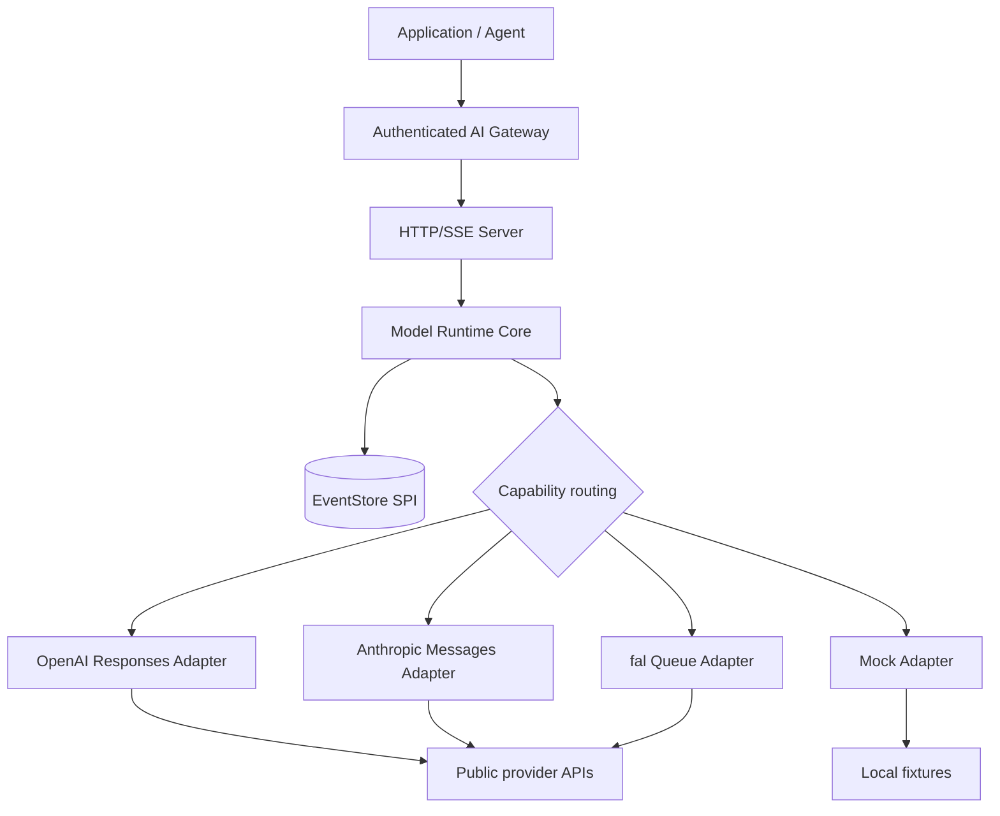

# Architecture

Model Runtime API is a provider-neutral execution data plane. It can run as a shared service,
sidecar, or embedded core, but the public contract does not absorb tenant-gateway or billing duties.



## Package ownership

| Package | Owns | Does not own |
| --- | --- | --- |
| `protocol` | Public types, generated request schema, events, usage vocabulary | Provider HTTP behavior |
| `transport` | Shared browser-compatible SSE parsing and bounded JSON response reads | Model routing or credentials |
| `core` | Registry, routing, flow control, EventStore SPI, lifecycle | Tenant authentication or prices |
| `server` | HTTP/SSE projection and safe config assembly | Internet-facing security |
| `provider-*` | One public provider protocol translation | Cross-provider policy |
| `conformance` | Reusable lifecycle assertions | Vendor live-account validation |
| `otel` | Metadata-only GenAI attribute mapping | Prompt/output capture |
| `catalog` | Capability snapshots and diffs | Automatic production release |
| `sdk-*` | Runtime HTTP/SSE clients | Provider credentials or routing |

## Synchronous model path


*The image explains stages; the event order below defines behavior.*

```text
submit -> accepted -> capability filter -> route.selected
       -> acquire provider gate -> provider stream
       -> output/tool/usage events -> completed
```

Retryable failures before exposed output can emit `route.attempt_failed` and move to the next
capable candidate while fallback, maximum attempts and retry budget permit it. Output is never
rolled back or combined across attempts.

## Asynchronous media path

```text
submit -> accepted -> provider queue submit
       -> queued / processing progress
       -> provider result -> output.result + artifacts
       -> completed
```

The runtime records artifact references but does not dereference or persist them. Deployments own
download allowlists, malware checks, retention, and durable storage.

## Provider translation boundary


Adapters translate provider-specific requests and events. They do not control execution IDs,
runtime sequence numbers, routing policy, tenant identity, or billing.

## Recovery model

Every event has an execution-scoped, contiguous sequence. Event consumers reconnect with `after` or
`Last-Event-ID`. The bundled memory store recovers only within one process; a durable production
store must implement the same EventStore SPI and protect tenant ownership outside the public core.

## Configuration and credentials

`MODEL_RUNTIME_CONFIG` may reference provider credentials only by environment-variable name.
Configuration validation rejects inline fields named like credentials. Adapter errors and public
events never include credential values or provider response bodies.

All provider HTTP requests reject redirects. fal submission and lifecycle URLs must remain on the
configured origin, without embedded credentials, queries or fragments. Artifact references are not
fetched, and media-URI egress controls remain a gateway/deployment responsibility.

## Transport and shutdown

Provider and TypeScript client streams share `eventsource-parser` through the `transport` package.
It handles SSE comments, line-ending variants, fragmented UTF-8 and optional field spaces. Event
data plus ID/type fields are limited to 1 MiB in UTF-8; the parser separately caps pending buffers
at 1 MiB characters (at most 4 MiB UTF-8). JSON responses are capped at 4 MiB. Abandoned or oversized
bodies are cancelled rather than merely unlocked. Incomplete EOF frames are discarded; an observed
runtime stream without a terminal event is reported as truncated by clients.

The server waits for socket drain before pulling more events. Stream failures destroy the affected
response without emitting raw exception content or crashing the server. Closing SSE stops that
subscriber, not the underlying execution; use the explicit cancellation endpoint to stop work.

`ModelRuntime.shutdown()` closes admission, aborts active/queued work and waits for submitted work,
including pending store creation. Providers must honor cancellation; custom store operations must
be time-bounded.
The CLI bounds shutdown with `MODEL_RUNTIME_SHUTDOWN_GRACE_MS` (1 to 60000 ms, default 10000 ms);
if a request or provider prevents clean closure it closes connections and exits with status 1.
