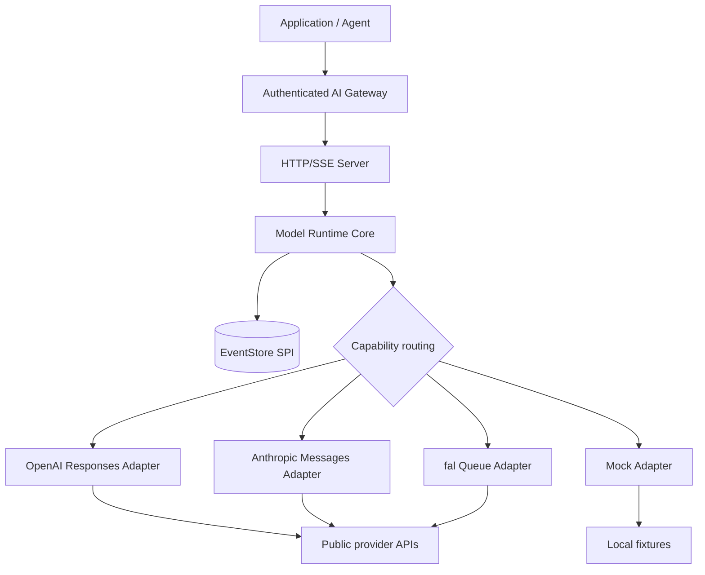

# Architecture

Model Runtime API is a provider-neutral execution data plane. It can run as a shared service,
sidecar, or embedded core, but the public contract does not absorb tenant-gateway or billing duties.



## Package ownership

| Package | Owns | Does not own |
| --- | --- | --- |
| `protocol` | Public types, generated request schema, events, usage vocabulary | Provider HTTP behavior |
| `core` | Registry, routing, flow control, EventStore SPI, lifecycle | Tenant authentication or prices |
| `server` | HTTP/SSE projection and safe config assembly | Internet-facing security |
| `provider-*` | One public provider protocol translation | Cross-provider policy |
| `conformance` | Reusable lifecycle assertions | Vendor live-account validation |
| `otel` | Metadata-only GenAI attribute mapping | Prompt/output capture |
| `catalog` | Capability snapshots and diffs | Automatic production release |
| `sdk-*` | Runtime HTTP/SSE clients | Provider credentials or routing |

## Synchronous model path


*The image explains stages; the event order below defines behavior.*

```text
submit -> accepted -> capability filter -> route.selected
       -> acquire provider gate -> provider stream
       -> output/tool/usage events -> completed
```

Retryable failures can emit `route.attempt_failed` and move to the next capable candidate while the
maximum attempts and retry budget remain available.

## Asynchronous media path

```text
submit -> accepted -> provider queue submit
       -> queued / processing progress
       -> provider result -> output.result + artifacts
       -> completed
```

The runtime records artifact references but does not dereference or persist them. Deployments own
download allowlists, malware checks, retention, and durable storage.

## Provider translation boundary


Adapters translate provider-specific requests and events. They do not control execution IDs,
runtime sequence numbers, routing policy, tenant identity, or billing.

## Recovery model

Every event has an execution-scoped, contiguous sequence. Event consumers reconnect with `after` or
`Last-Event-ID`. The bundled memory store recovers only within one process; a durable production
store must implement the same EventStore SPI and protect tenant ownership outside the public core.

## Configuration and credentials

`MODEL_RUNTIME_CONFIG` may reference provider credentials only by environment-variable name.
Configuration validation rejects inline fields named like credentials. Adapter errors and public
events never include credential values or provider response bodies.
