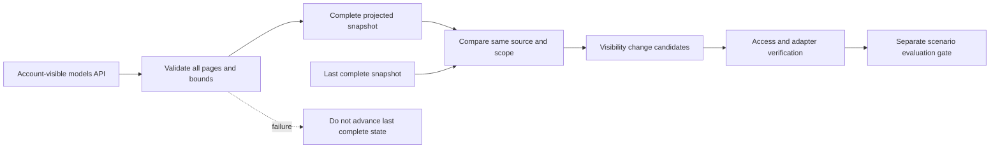

# Model discovery and radar

As of 2026-10-09. This workflow detects changes in **account-visible model inventory**. It does not
claim that a newly visible model was just launched, or that a missing model was retired globally.
Visibility can change because of account permissions, aliases, regions or vendor inventory updates.

## Two different catalogs

| Source | What it proves | What it does not prove |
| --- | --- | --- |
| Runtime `/v1/providers` | Configured provider/model capability declarations | Vendor-wide inventory or live support |
| Vendor model-list API | Models visible to the supplied credential scope | Global release date, endpoint compatibility or quality |
| Scenario evaluation | Observed results for an exact suite/run | An official general-purpose benchmark ranking |

The bundled discovery readers use the public
[OpenAI model-list API](https://developers.openai.com/api/reference/resources/models/methods/list)
and [Anthropic model-list API](https://platform.claude.com/docs/en/api/typescript/models/list).
Anthropic pagination is followed until `has_more` is false. Public model announcements that have
not reached this account's list are outside this detector. fal discovery is not implemented:
its execution adapter remains available, but this command must not pretend to list its whole catalog.



## Run once

The credential is supplied by an environment variable or secret manager. Arguments contain only
the variable name. Use a dedicated authorized project account, never credentials borrowed from
another system. The CLI contacts the official endpoints; custom HTTPS/loopback source URLs are a
programmatic option for integrations and fixtures, not a command-line credential escape hatch.

```bash
pnpm build
umask 077
mkdir -p .model-research
node packages/catalog/dist/cli.js discover openai PROVIDER_A_API_KEY account-a > .model-research/current.json
node packages/catalog/dist/cli.js radar .model-research/current.json
node packages/catalog/dist/cli.js radar .model-research/previous.json .model-research/current.json
```

The first radar output is `baseline`, with no added-model alerts. Later output has:

- `added_models`: now visible but absent from the previous complete inventory;
- `no_longer_visible_models`: previously visible but absent now;
- `metadata_changed_models`: projected vendor creation metadata changed for the same ID;
- `observed_at` and `previous_observed_at`: observation times, not release dates.

`vendor_created_at` is vendor-supplied creation metadata, not a verified launch time. Discovery
snapshots deliberately omit display names, owning organizations, credentials, endpoint URLs,
capabilities, request content and financial metadata. Inventory IDs can still reveal private
fine-tunes or account-specific access. **Treat all generated snapshots and radar output as private**;
projection is not permission to publish them.

## Scheduled single-shot polling

Use `poll` for automatic refresh. Shell `> file` redirection can truncate an old file before the
discovery command runs, even when the command later fails; never use it to overwrite a baseline.

```bash
node packages/catalog/dist/cli.js poll openai PROVIDER_A_API_KEY account-a .model-research/openai
node packages/catalog/dist/cli.js poll anthropic PROVIDER_B_API_KEY account-b .model-research/anthropic
```

The state directory is dedicated to one source and scope. Polling writes `state.json`, containing
the complete snapshot and its radar report together. Use a stable opaque scope label; do not use a
real organization or customer name. New account/region/endpoint visibility must use a new scope
and directory. Credential rotation within the same account may retain the same scope. The tool
does not query a vendor organization identifier to prove that the caller labeled the scope correctly.

Schedule this command through an existing private job runner with its secret environment injected.
For example, a six-hour cadence can use `0 */6 * * *`; no scheduler is installed by this project.
Prebuild the repository, set the working directory explicitly, and invoke the compiled CLI.
Do not place credential values in a crontab, public Actions logs, or shell arguments.

Each invocation prints one JSON radar report and exits. The state contains only the latest report;
archive stdout in a private, retained sink if event history is required. Notification delivery,
recipient authorization and exactly-once alert acknowledgement belong to that surrounding runner.
Failed jobs must alert separately; do not label an old snapshot as current merely because a file
still exists. Track successful `observed_at` freshness against the configured cadence.

## Failure and safety contract

- A poll either obtains every required page or fails; partial data cannot advance the baseline.
- Reading every page does not prove a transaction-consistent vendor inventory: vendors can change
  visibility during pagination. Recheck candidates; do not treat a diff as an automatic release action.
- Fetch/body reading and credential resolution share a 30-second deadline (programmatic maximum
  120 seconds). Responses are limited to 1 MiB per page, 100 pages and 10000 unique models.
- Repeated IDs/cursors, malformed paging fields or invalid metadata cause failure, not truncation.
- Snapshot digests are checked on input; comparing a different provider/scope or older observation
  is rejected. Digests are not signatures or proof of account identity.
- Directory/file permissions are 0700/0600, with ownership checks and no symlink state reads.
  Existing shared-permission directories are refused rather than silently modified.
- A heartbeat writer lease rejects overlaps. State is fsynced and atomically replaced as one
  document, bounded to 4 MiB. Failures before replacement preserve old state; a post-replacement
  filesystem sync failure is not reported as success and requires operator inspection.
- Redirects are rejected, even to a same-origin location. CLI errors omit raw bodies, secrets,
  source URLs, local paths and parser diagnostics. Failure exits with code 1; bad usage uses code 2.

This is a local single-writer workflow, not a distributed event bus or hosted model-monitoring
service. Candidate models must still pass account access, declared adapter compatibility, protocol
smoke and scenario evaluation before production routing is changed. No routing policy is changed
automatically by discovery.
