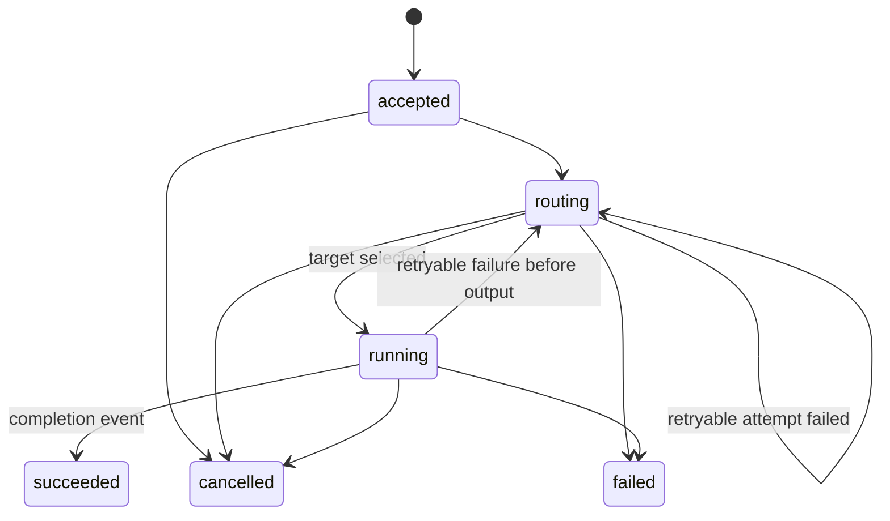

# Runtime model

Status: pre-alpha normative draft.

## Roles

| Role | Responsibility |
| --- | --- |
| Caller | Submits an ability, requirements, input, deadline, and optional policy reference |
| AI gateway | Authenticates tenants and enforces tenant quotas and budgets outside this protocol |
| Model runtime | Selects a capable target, controls provider execution, emits events, and records usage facts |
| Provider adapter | Translates one public provider protocol into the runtime Provider SPI |
| Billing system | Resolves prices and produces customer-facing financial records outside this protocol |

## Execution state machine


*Concept image only. The state diagram below is normative.*



An execution has one identifier and an append-only sequence of events. Sequence values start at one
and increase monotonically. `execution.completed` and `execution.failed` are terminal.

## Identity layers

The protocol keeps these identities separate:

```text
ability -> routing policy -> provider -> provider model
```

An ability is stable application intent. Provider and model identify the resolved execution target.
The runtime must return the resolved target; it must not imply that every provider model is
semantically interchangeable.

## Routing boundary

The runtime owns execution routing primitives:

- required-capability filtering;
- deterministic candidate ordering;
- bounded retry and fallback;
- caller-declared maximum attempts constrained by a wall-clock retry budget;
- provider-local concurrency and queue admission;
- route-attempt evidence.

`allow_fallback: false` permits only one target attempt, even when `max_attempts` is larger.
Fallback is allowed only before any text delta, tool call, tool-argument delta, or result is exposed.
After output begins, an error is terminal and non-retryable; partial output remains diagnostic
evidence and must not be treated as a successful result. Progress and usage events alone do not
commit output. Provider adapters may further restrict retries when a remote task could still run.

Tenant access, commercial plans, organization budgets, and arbitrary caller-supplied routing weights
belong to a gateway or control plane.

## Usage and billing boundary

The runtime emits non-negative usage facts with explicit units and sources. A usage fact describes
what happened; it does not contain a customer price.

```text
usage fact -> price resolution -> ledger -> invoice
```

Only the first step is normative in this project. Optional pricing experiments must remain separate
from execution truth and must never turn an unmatched unit into zero cost silently.

## Deployment modes

- Shared data plane behind an AI gateway: recommended for centralized routing and flow control.
- Sidecar: useful for local policy or credential isolation, with external coordination when limits
  must be global.
- Embedded core: intended for tests, CLIs, and single-process development.

The reference server is a protocol development tool, not a production gateway.

## Storage and recovery

The core depends on an EventStore SPI. The bundled in-memory implementation supports append-only
events, materialized status/result, and resumable cursors within one process. Production durability,
cross-instance coordination, retention, encryption, and backup belong to a deployment-specific
EventStore implementation.
